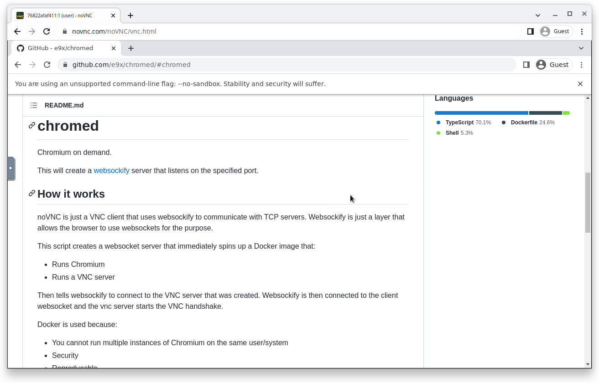

# chromed

Chromium on demand.

This will create a [websockify](https://github.com/e9x/websockify) server that listens on the specified port.

## How it works

noVNC is just a VNC client that uses websockify to communicate with TCP servers. Websockify is just a layer that allows the browser to use websockets for the purpose.

This script creates a websocket server that immediately spins up a Docker image that:

- Runs Chromium
- Runs a VNC server

Then tells websockify to connect to the VNC server that was created. Websockify is then connected to the client websocket and the vnc server starts the VNC handshake.

Docker is used because:

- You cannot run multiple instances of Chromium on the same user/system
- Security
- Reproducable
- Managable (You just kill the docker run command to stop the container! No daemon stuff)

## Usage

1. Clone

   ```sh
   git clone https://github.com/e9x/chromed.git
   cd chromed
   ```

2. Install NPM dependencies

   ```sh
   npm install
   ```

3. Compile the code

   ```sh
   npm run build
   ```

4. Build the Docker image

   ```sh
   cd docker
   docker build -t chromed .
   cd ..
   ```

5. Start the script

   ```sh
   npm start 127.0.0.1:1080
   ```

6. Optionally use PM2 to run in the background

   ```
   pm2 start "npm start 127.0.0.1:1080" --name "chromed"
   ```

7. Use noVNC to connect to the websocket server.

   > You can use any noVNC instance. The client will connect directly to the WebSocket server.

   Click on the settings icon (gears), advanced settings, websocket then enter the following:

   - Enable/disable encrypt depending on if you are running this behind a reverse proxy with SSL (nginx, cloudflare)
     If you don't know this/are just testing, try disabling it.
   - Change the path if you're running this behind a reverse proxy.
   - Change the host to the address you passed to `npm start`, eg **127.0.0.1**:1080 `127.0.0.1`
   - Change the port to the port you passed to `npm start`, eg 127.0.0.1:**1080** `1080`


